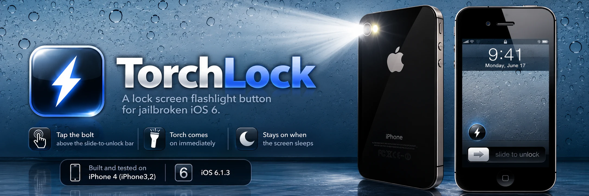

# TorchLock



*Illustration, not a screenshot. The real button is a dark circle with a white
bolt when the torch is off, and a white circle with a yellow bolt when it's on.
The clock and date shown are invented.*

A lock screen flashlight button for **jailbroken iOS 6**, written to replace
[FlashLock](docs/FLASHLOCK.md), which lags on iOS 6.

Tap the bolt above the slide-to-unlock bar and the torch comes on immediately,
then stays on when the screen goes to sleep. With FlashLock on the same phone
you got one blink, a frozen lock screen that then went dark, and the light a
few seconds later.

Built and tested on an **iPhone 4 (iPhone3,2), iOS 6.1.3**.

## What it does

- **A button on the lock screen**, just above the left end of the unlock
  slider. It's always visible by default, or it can appear only after you
  double-click Home. It shows a dark circle when the torch is off, and a white
  circle with a yellow bolt when it is on.
- **Drives the torch directly.** It sets `torchMode` on the camera device, so
  no `AVCaptureSession` runs, nothing blocks SpringBoard's main thread and the
  camera doesn't stream frames while the light is on.
- **Doesn't let the screen dim right after a tap.** A tap counts as activity,
  so the lock screen dim timer restarts.
- **Turns the torch off when you unlock.** You can keep it on instead, see
  [Settings](#settings).
- **A Settings pane**, like FlashLock's. **Settings → TorchLock** has a switch
  that turns the whole tweak on or off, plus the lock screen options.
- **Adds an Activator action.** "Toggle Flashlight" (`com.aurelio.torchlock.toggle`)
  appears under *TorchLock* in Activator, so you can give it a gesture for use
  while unlocked.

## Requirements

On the phone:

- jailbroken iOS 6 with MobileSubstrate
- Cydia, to install from the source, or OpenSSH, to install from a PC
- Activator, optional, for the gesture action and for `make smoke`

On the PC:

- Linux on x86_64
- `git`, `curl`, `make`, `perl`
- libimobiledevice, for `iproxy` (USB to SSH)

## Install

### From Cydia (easiest)

1. In Cydia, go to **Sources → Edit → Add** and enter:

   ```
   https://aurelioochoa.github.io/torchlock/repo/
   ```

2. Open the **TorchLock** source, then the **TorchLock** package, and tap
   **Install**.

TorchLock conflicts with FlashLock, so if FlashLock is installed, Cydia will
offer to remove it as part of the install.

GitHub Pages only speaks modern HTTPS, which stock iOS 6 may not be able to
negotiate. The test phone had *TLS Fix* (`com.skyglow.tlsfix`, from
`http://cydia.skyglow.es/`) and already loaded another github.io source. If
Cydia can't load this source, install that fix first.

Updates arrive the same way: when a new version is published, refresh Cydia's
sources and it shows up under **Changes**.

### From a PC

#### 1. Remove FlashLock

TorchLock declares `Conflicts: com.filippobiga.flashlock`. Unlike Cydia, plain
dpkg doesn't resolve that for you, and it refuses to install TorchLock while
FlashLock is present. That's deliberate: two buttons
fighting over one torch don't work. Remove FlashLock in Cydia (**Installed →
FlashLock → Modify → Remove**), or over SSH:

```sh
dpkg -r com.filippobiga.flashlock
```

Skip this step if you never installed FlashLock.

#### 2a. Over USB

Plug the iPhone in, then from the repo:

```sh
make setup   # once: Theos + Linux iOS toolchain + iOS 10.3 SDK into ~/theos
make run     # build, copy to the phone, dpkg -i, respring
```

`make run` starts `iproxy` on `PORT` (default 2222), then SSHes to the phone as
root and asks for the root password once. When it finishes, SpringBoard
restarts and the lock screen comes back with the button.

#### 2b. By hand, over Wi-Fi

If you already have a `.deb` (`make build` puts it in `tweak/packages/`), you
can install it over Wi-Fi with one command. It copies the package, installs it
and resprings. To find `PHONE_IP`, go to **Settings → Wi-Fi** and tap the blue
arrow next to your network.

```sh
ssh -o HostKeyAlgorithms=+ssh-rsa -o PubkeyAcceptedAlgorithms=+ssh-rsa root@PHONE_IP \
    'cat > /tmp/torchlock.deb && dpkg -i /tmp/torchlock.deb && killall -9 SpringBoard' \
    < tweak/packages/com.aurelio.torchlock_1.0.1_iphoneos-arm.deb
```

The phone's OpenSSH only offers an `ssh-rsa` host key, which current OpenSSH
refuses unless those two options are given. Over USB instead of Wi-Fi, run
`iproxy 2222 22` first and use `-p 2222 root@localhost`.

### Check it worked

Lock the phone and wake it. A round bolt button sits just above the left end
of the slide-to-unlock bar: tap it to turn the torch on, and tap again to turn
it off. To check from the PC, run `make smoke`. The torch should light for
about three seconds.

If the button doesn't appear, confirm the package is installed (`dpkg -s
com.aurelio.torchlock`). Also check that SpringBoard isn't in Substrate safe
mode, which shows as a "Safe Mode" alert after a respring.

### Settings

Open **Settings → TorchLock**. Every switch is on by default, and changes take
effect straight away, with no respring.

| Switch | What it does |
| --- | --- |
| **Enabled** | Turns TorchLock on or off. When it's off, there's no lock screen button and the Activator action is ignored. A torch TorchLock lit is also turned off. |
| **Always Show Button** | When this is off, the button stays hidden until you double-click Home on the lock screen. While the torch is on, the button always shows, so you can turn it off. |
| **Turn Off on Unlock** | Turns the torch off when you unlock. Switch it off to keep the light on after unlocking. |

The values are stored in
`/var/mobile/Library/Preferences/com.aurelio.torchlock.plist` under the keys
`Enabled`, `AlwaysShowButton` and `TurnOffOnUnlock`. Deleting the file
restores the defaults.

FlashLock had a fourth switch, *Hide Slider Label*. TorchLock doesn't need it:
FlashLock's button sat inside the unlock slider and covered its text, but
TorchLock's sits above it.

**Toggle with a gesture.** With Activator installed, open
**Settings → Activator**, choose where the gesture should work (anywhere, the
home screen, in apps or the lock screen), and pick an event, for example a
short hold of Volume Up. Then choose **Toggle Flashlight** under **TorchLock**.
This works with the phone unlocked too, where the lock screen button isn't
available.

### Uninstall

```sh
make uninstall                     # from the PC, over USB
dpkg -r com.aurelio.torchlock && killall -9 SpringBoard   # or on the phone
```

Or remove **TorchLock** in Cydia. Afterwards you can reinstall FlashLock from
Cydia if you want it back.

## Development

| Target | What it does |
| --- | --- |
| `make dev` | Debug build, install, respring. Adds a second Activator listener, `com.aurelio.torchlock.debug`, which writes the torch state and the lock screen view tree to `/tmp/torchlock-debug.txt` and a screenshot to `/tmp/torchlock-screen.png` on the phone |
| `make check` | Check that the Cydia index matches `repo/debs/`, then a clean compile with `-Werror` |
| `make verify` | `check`, then a release package |
| `make deploy DEB=<path>` | Install any package on the phone |
| `make uninstall` | Remove TorchLock from the phone and respring |
| `make cydia` | Copy the release package into `repo/debs/` and regenerate the Cydia index |

There are no unit tests, because the tweak only runs inside SpringBoard.
Testing it means running it on a device: `make smoke`, or in a debug build,
`activator send com.aurelio.torchlock.debug` followed by reading `/tmp/torchlock-debug.txt`.

[`docs/BUILDING.md`](docs/BUILDING.md) explains the toolchain choices (why the
10.3 SDK, why `-Wl,-U,_memset`, why gzip packages).

### Publishing a new version

1. Bump `Version` in `tweak/control`. `make cydia` won't replace a version that
   is already published, because phones that installed it would never see the
   new build.
2. Run `make cydia`. It builds, adds the `.deb` to `repo/debs/`, and rewrites
   `Packages`, `Packages.gz`, `Packages.bz2` and `Release`.
3. Commit `repo/` and push. GitHub Pages serves it within a minute or two.

## Verified

All on the iPhone 4 / iOS 6.1.3 above:

- SpringBoard loads it with no crash and no safe mode, for both debug and
  release builds.
- Toggling through Activator switches the torch at once. `torchMode` and
  `isTorchActive` still matched after 6, 8 and 30 seconds.
- The backlight turned off (kernel log) eight seconds after the torch came on,
  and the torch stayed lit until it was toggled off 30 seconds later.
- The button is drawn above the left end of the unlock slider. This was
  checked with the debug build's screenshot.
- Each setting was checked by writing the preference file and sending the
  pane's change notification:
  - Turning **Enabled** off switched off a lit torch and removed the button,
    and Activator toggles were then ignored. Turning it back on restored both.
  - With **Always Show Button** off, the button was hidden, showed while the
    torch was on, and hid again once it was off.
  - Deleting the preference file brought the defaults back.

Not yet checked by a test:

- the unlock-turns-it-off path, which hooks `-[SBAwayController didFinishAnimatingOut]`
- the Home double-click reveal, which hooks `-[SBAwayController handleMenuButtonDoubleTap]`
- the Settings pane drawn inside the Settings app

## Layout

```
Makefile          standard verbs; wraps the Theos project
tweak/
  Makefile        Theos project (target, arch, flags)
  Tweak.x         the tweak (Logos)
  TorchLock.plist Substrate filter: SpringBoard only
  control         Debian package metadata
  layout/Library/PreferenceLoader/Preferences/TorchLock/
                  Settings pane (PreferenceLoader plist + 29/58px icons)
docs/
  assets/         README banner (WebP)
  BUILDING.md     toolchain notes
  FLASHLOCK.md    why FlashLock misbehaves on iOS 6
repo/             the Cydia source, served by GitHub Pages
  debs/           every published .deb
  Packages*       index (plain, gzip, bzip2), generated
  Release         source metadata + index hashes, generated
  CydiaIcon.png   source icon shown in Cydia
  index.html      what Safari shows at the source URL
scripts/
  cydia-index.py  builds the index (stdlib only, no dpkg needed)
index.html        Pages root, redirects to repo/
.nojekyll         serve files as-is, no Jekyll
```
